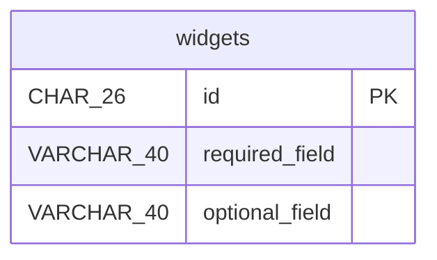

# online-shop

## widgets

Widget information is needed after creation so the service can confirm
the widget was registered.

| Column | Data Type | Nullable | Description |
| --- | --- | --- | --- |
| id | CHAR(26) | no | Auto-assigned surrogate key |
| required\_field | VARCHAR(40) | yes | - |
| optional\_field | VARCHAR(40) | no | - |

### Primary Key

| Constraint Name | Columns |
| --- | --- |
| pk\_widgets | id |

## DDL

```sql
CREATE TABLE widgets (
  id CHAR(26) NOT NULL,
  required_field VARCHAR(40),
  optional_field VARCHAR(40) NOT NULL,
  CONSTRAINT pk_widgets PRIMARY KEY (id)
);
```

## ER Diagram


