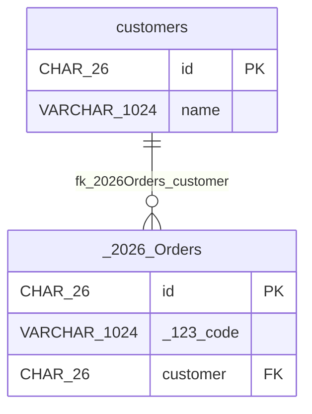

# online-shop

## customers

Customer records are needed to review optional Mermaid relationships.

| Column | Data Type | Nullable | Description |
| --- | --- | --- | --- |
| id | CHAR(26) | no | Auto-assigned surrogate key |
| name | VARCHAR(1024) | no | - |

### Primary Key

| Constraint Name | Columns |
| --- | --- |
| pk\_customers | id |

## 2026"Orders

Customer metadata is needed to review Mermaid identifier sanitization.

| Column | Data Type | Nullable | Description |
| --- | --- | --- | --- |
| id | CHAR(26) | no | Auto-assigned surrogate key |
| 123\_code | VARCHAR(1024) | no | - |
| customer | CHAR(26) | yes | - |

### Primary Key

| Constraint Name | Columns |
| --- | --- |
| pk\_2026Orders | id |

### Foreign Keys

| Constraint Name | Column | Referenced Table | Referenced Column | Kind |
| --- | --- | --- | --- | --- |
| fk\_2026Orders\_customer | customer | customers | id | explicit |

## DDL

```sql
CREATE TABLE "customers" (
  "id" CHAR(26) NOT NULL,
  "name" VARCHAR(1024) NOT NULL,
  CONSTRAINT "pk_customers" PRIMARY KEY ("id")
);

CREATE TABLE "2026""Orders" (
  "id" CHAR(26) NOT NULL,
  "123_code" VARCHAR(1024) NOT NULL,
  "customer" CHAR(26),
  CONSTRAINT "pk_2026Orders" PRIMARY KEY ("id"),
  CONSTRAINT "fk_2026Orders_customer" FOREIGN KEY ("customer") REFERENCES "customers" ("id")
);
```

## ER Diagram


