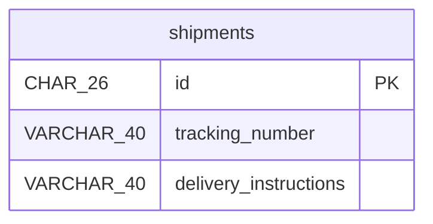

# online-shop

## shipments

Shipment information is needed after creation so the service can confirm
the shipment was registered.

| Column | Data Type | Nullable | Description |
| --- | --- | --- | --- |
| id | CHAR(26) | no | Auto-assigned surrogate key |
| tracking\_number | VARCHAR(40) | yes | - |
| delivery\_instructions | VARCHAR(40) | no | - |

### Primary Key

| Constraint Name | Columns |
| --- | --- |
| pk\_shipments | id |

## DDL

```sql
CREATE TABLE shipments (
  id CHAR(26) NOT NULL,
  tracking_number VARCHAR(40),
  delivery_instructions VARCHAR(40) NOT NULL,
  CONSTRAINT pk_shipments PRIMARY KEY (id)
);
```

## ER Diagram


