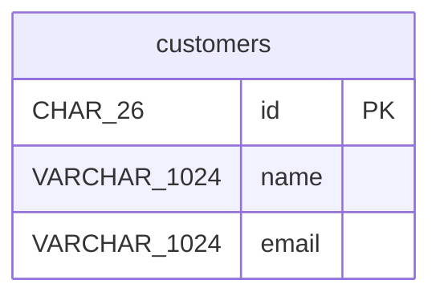

# no-openapi-shop

## customers

Customer data stored without an OpenAPI source.

| Column | Data Type | Nullable | Description |
| --- | --- | --- | --- |
| id | CHAR(26) | no | Auto-assigned surrogate key |
| name | VARCHAR(1024) | no | - |
| email | VARCHAR(1024) | no | - |

### Primary Key

| Constraint Name | Columns |
| --- | --- |
| pk\_customers | id |

## DDL

```sql
CREATE TABLE "customers" (
  "id" CHAR(26) NOT NULL,
  "name" VARCHAR(1024) NOT NULL,
  "email" VARCHAR(1024) NOT NULL,
  CONSTRAINT "pk_customers" PRIMARY KEY ("id")
);
```

## ER Diagram


