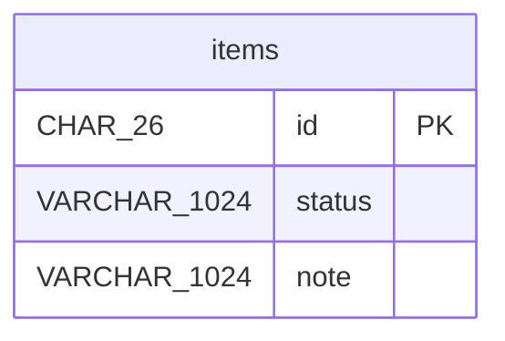

# escape-test

## items

Escape testing for special characters.

| Column | Data Type | Nullable | Description |
| --- | --- | --- | --- |
| id | CHAR(26) | no | Auto-assigned surrogate key |
| status | VARCHAR(1024) | no | pipe\|alias |
| note | VARCHAR(1024) | no | back\\slash |

### Primary Key

| Constraint Name | Columns |
| --- | --- |
| pk\_items | id |

### Check Constraints

| Constraint Name | Column | Allowed Values |
| --- | --- | --- |
| ck\_items\_status | status | O'Brien, pipe\|enum |

## DDL

```sql
CREATE TABLE "items" (
  "id" CHAR(26) NOT NULL,
  "status" VARCHAR(1024) NOT NULL,
  "note" VARCHAR(1024) NOT NULL,
  CONSTRAINT "pk_items" PRIMARY KEY ("id"),
  CONSTRAINT "ck_items_status" CHECK ("status" IN ('O''Brien', 'pipe|enum'))
);
```

## ER Diagram


